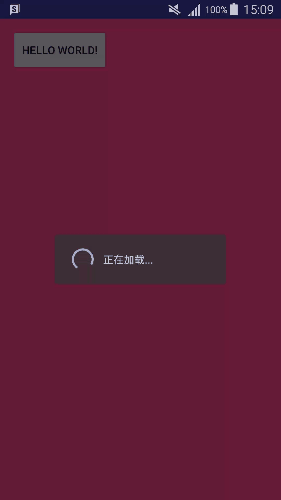

# okhttp使用简单封装库

## 简介
okhttp执行网络请求时是自动开子线程进行的，但是处理网络数据回调回来时，也在子线程中，而我们日常开发主要是在主线程中更新UI，这样是极不方便的，为了解决这个问题和简化okhttp的使用难度，本库对okhttp做了一个简单的封装,在网络不好的情况下，会弹出加载框提示用户在加载中，当然用户也可以选择不使用加载框

## 版本说明：

__okhttp版本信息：3.6.0__

## 效果示意图


## 使用说明
本库分为三个类：

	1. OkHttpManager -- 网络底层类，执行网络请求的真正实现类
	
	2. NetCall       -- 网络请求类标准接口，OKHttpManager就实现这个接口，如果要添加新的网络访问方式，就在这个类添加标准接口即可

	3. NetCallBack   -- 网络回调类，网络请求完成后回调类

## 使用步骤

+ 初始化OkHttp实例   --- OkHttpManager.getInstance()
+ 准备网络请求参数并发起网络    --- NetCall里面标准接口
+ 回调到UI线程      --- NetCallBack

__在网络不好的情况下，自动是1s后还没有收到回调就要弹出加载框，显示友好界面，当然你也可以选择不弹出加载框，只需要你创建回调接口NetCallBack，不使用带有Activity那个构造方法即可；如果要弹窗就使用这个即可，放心使用里面使用了弱引用，不会造成内存泄漏的__

### 具体使用方法：
以一个登陆Activity里面使用为例说明：

#### 初始化OKHttp

```java
private NetCall mNetManager = OkHttpManager.getInstance();
```

#### 初始化网络回调NetCallBack
```java
private static class NetBack extends NetCallBack {
        WeakReference<MainActivity> weakReference;
        public NetBack(int flag, MainActivity activity) {
            super(flag, activity);          //这里我要使用弹出加载框

            weakReference = new WeakReference<>(activity);

        }

        /**
         * okhttp回调
         * @param str 回调的字符串
         * @param taskFlag  任务标志
         */
        @Override
        public void responseToMainThread(String str, int taskFlag) {
            MainActivity activity = weakReference.get();
            if(null == activity){
                return;
            }

            switch (taskFlag){
                case LOGIN_TASK:
                    break;
            }

            JLog.i("j_net", str);
        }

        @Override
        public void responseTOMainError(int netTaskFlag) {
            MainActivity activity = weakReference.get();

            if(null == activity){
                return;
            }
        }
    }


```
#### 发起网络请求
```java
 HashMap<String,String> loginParams = new HashMap<>();
        loginParams.put("mobile", "username");
        loginParams.put("password", "password");

        String params = new JSONObject(loginParams).toString();

        mNetManager.OkHttpPostJSON(params, new NetBack(LOGIN_TASK, this));  //开始网络请求
```
这样就完成一次网络请求了

## 总结
自己封装的时候也看了Retrofit网络库，现在2.2版本的底层也是使用的OK，Retrofit用起来比较繁琐，需要定义许多网络请求接口还要去注册等，这是本人的拙见哈，不对还请指正，说明Retrofit的好处；我封装的库优点有二：
+ 支持加载框的友好提示界面
+ 支持网络请求类型taskFlag，根据这个类型你可以处理不同的网络结果

如有不足，还请拍砖....
